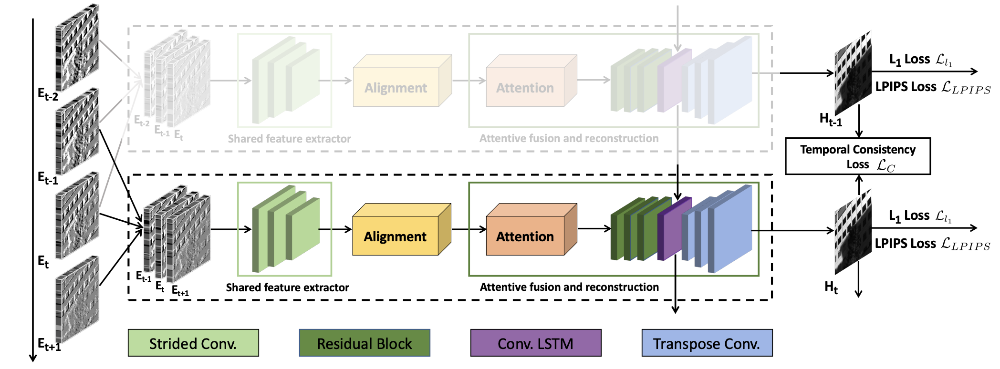
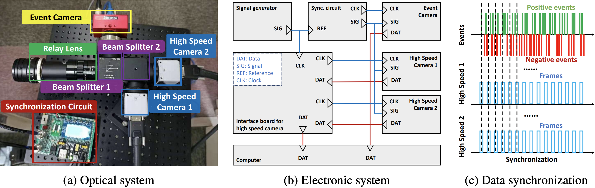
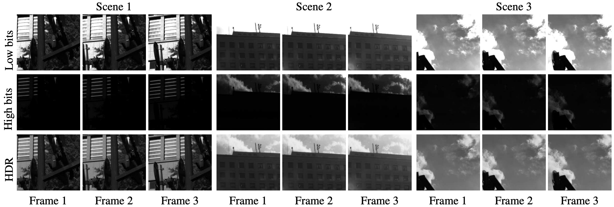

# EventHDR
 This is the implementation and dataset for [Learning To Reconstruct High Speed and High Dynamic Range Videos From Events](https://openaccess.thecvf.com/content/CVPR2021/papers/Zou_Learning_To_Reconstruct_High_Speed_and_High_Dynamic_Range_Videos_CVPR_2021_paper.pdf), CVPR 2021, by Yunhao Zou, Yinqiang Zheng, Tsuyoshi Takatani and Ying Fu.

## News
* 2023/09/19: The dataset is avalable at [**[OneDrive]**](https://1drv.ms/f/s!AuA3qjJbfh9FjQa4GvHC_9Fn9UQm?e=jODI9N)
## Introduction
In this work, we present
a convolutional recurrent neural network which takes a
sequence of neighboring event frames to reconstruct high speed HDR videos. To facilitate the process of network learning, we design a novel optical system and collect a real-world dataset with paired high speed HDR videos and event streams.

## Highlights
* We propose a convolutional recurrent neural network for the reconstruction of high speed HDR videos from events. Our architecture carefully considers the alignment and temporal correlation for events.



* To bridge the gap between simulated and real HDR videos, we design an elaborate system to synchronously capture paired high speed HDR video and the corresponding event stream.



* We collect a real-world dataset with paired high speed HDR videos (high-bit) and event streams. Each frame of our HDR videos are merged from two precisely synchronized LDR frames.



## Dataset
* You can download our EventHDR dataset at [**[OneDrive]**](https://1drv.ms/f/s!AuA3qjJbfh9FjQa4GvHC_9Fn9UQm?e=jODI9N)
* Both the training and testing data are stored in ```hdf5``` format, you can use ```h5py``` tool to read the data.
* We build our dataset based on the data structure of [**events_contrast_maximization**](https://github.com/TimoStoff/events_contrast_maximization/tree/master), and the structure tree is shown below
```
EventHDR Dataset Structure Tree
+-- '/'
|   +-- attribute "duration"
|   +-- attribute "num_events"
|   +-- attribute "num_flow"
|   +-- attribute "num_neg"
|   +-- attribute "num_pos"
|   +-- attribute "sensor_resolution"
|   +-- attribute "t0"
|   +-- group "events"
|   |   +-- dataset "ps"
|   |   +-- dataset "ts"
|   |   +-- dataset "xs"
|   |   +-- dataset "ys"
|   |   
|   +--	group "images"
|   |   +-- attribute "num_images"
|   |   +-- dataset "image000000000"
|   |   |   +-- attribute "event_idx"
|   |   |   +-- attribute "size"
|   |   |   +-- attribute "timestamp"
|   |   |   +-- attribute "type"
|   |   |   
|   ...
|   +--	group "images"
|   |   +-- attribute "num_images"
|   |   +-- dataset "image000002827"
|   |   |   +-- attribute "event_idx"
|   |   |   +-- attribute "size"
|   |   |   +-- attribute "timestamp"
|   |   |   +-- attribute "type"
|   |   |   
|   |   
|   
```
* To create a pytorch dataset, you can refer to [**```DynamicH5Dataset```**](https://github.com/TimoStoff/event_cnn_minimal/blob/master/data_loader/dataset.py)

## Citation
If you find this work useful for your research, please cite: 
```
@inproceedings{zou2021learning,
  title={Learning To Reconstruct High Speed and High Dynamic Range Videos From Events},
  author={Zou, Yunhao and Zheng, Yinqiang and Takatani, Tsuyoshi and Fu, Ying},
  booktitle={Proceedings of the IEEE/CVF Conference on Computer Vision and Pattern Recognition},
  pages={2024--2033},
  year={2021}
}
```
## contact
If you have any problems, please feel free to contact me at zouyunhao@bit.edu.cn